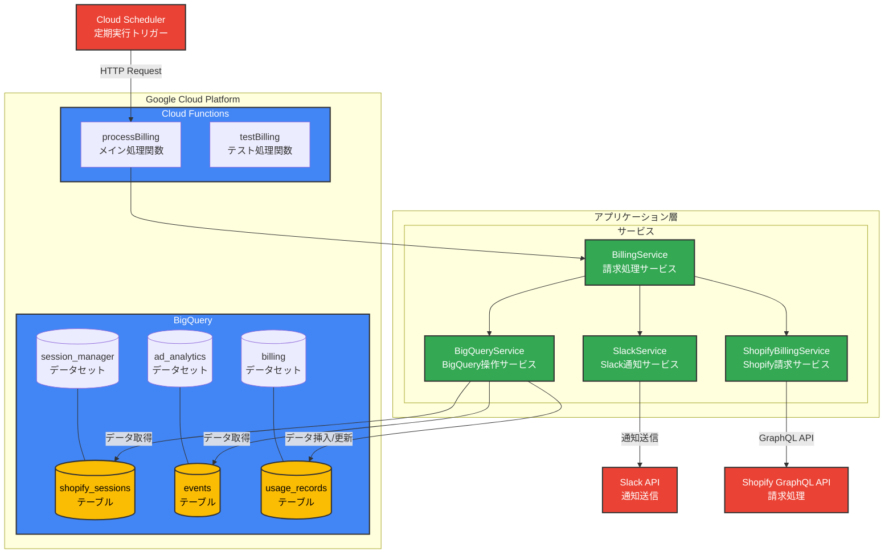

# Web Pixel Billing Batch

Shopifyの従量課金システム - Cloud Run、Pub/Sub、BigQueryを使用した自動課金処理バッチ

## 概要

このシステムは、Shopifyクライアントのページビュー数に基づいて従量課金を自動で処理するバッチシステムです。毎日日本時間25:00（翌日01:00）に実行され、前日のページビューデータを集計して課金レコードを生成し、Shopify GraphQL APIを通じて実際の課金を行います。

## 機能要件

- **スケジュール**: 日本時間25:00（翌日01:00）に毎日実行
- **データソース**: 
  - `growth-force-project.session_manager.shopify_sessions` - Shopifyセッション情報（アクセストークン含む）
  - `growth-force-project.ad_analytics.events` - ページビューイベント
- **課金レート**: 100万ページビューあたり$10
- **出力**: 
  - `growth-force-project.billing.usage_records` - 課金レコード（Shopify課金ステータス含む）
  - Shopify GraphQL API経由での実際の課金処理

## アーキテクチャ

### システム構成図



### システム構成要素

- **Cloud Functions**: TypeScriptで実装されたサーバーレス関数
- **Cloud Scheduler**: 日次実行トリガー（JST 01:00）
- **BigQuery**: データの読み取りと課金レコードの保存
- **Shopify GraphQL API**: 実際の課金処理
- **Slack API**: バッチ処理結果の通知

### 処理フロー

1. **アクティブセッション取得**: BigQueryから有効なShopifyセッションを取得
2. **ページビューデータ取得**: 前日のページビューイベントを集計
3. **請求レコード生成**: 課金額を計算してBillingRecordを生成
4. **BigQuery保存**: 請求レコードをusage_recordsテーブルに保存
5. **Shopify請求処理**: GraphQL APIを使用して各ショップに課金
6. **結果更新**: Shopify請求結果をBigQueryに更新
7. **Slack通知**: 処理結果の詳細をSlackに通知

## セットアップ

### 1. 依存関係のインストール

```bash
npm install
```

### 2. 環境変数の設定

```bash
# テンプレートをコピー
cp prod.env.template prod.env

# prod.envを編集して実際の値を設定
# - GOOGLE_CLOUD_SA_KEY: サービスアカウントキーのJSON
# - GOOGLE_CLOUD_PROJECT: プロジェクトID
# - SHOPIFY_API_VERSION: Shopify APIバージョン（デフォルト: 2024-01）
# - BATCH_SIZE: 並列処理数（デフォルト: 5）
# - MAX_RETRIES: リトライ回数（デフォルト: 3）
# - API_TIMEOUT_SECONDS: APIタイムアウト秒数（デフォルト: 30）
```

### 3. GitHub環境変数の設定

```bash
# prod.envからGitHub Secretsを自動設定
./scripts/setup-env.sh
```

### 4. ローカル開発

```bash
# 開発モードで起動
npm run dev

# ビルド
npm run build

# テスト実行
npm test

# リンター実行
npm run lint
```

## デプロイ

### 自動デプロイ（推奨）

mainブランチにプッシュすると、GitHub ActionsがCloud Runへ自動デプロイします。

```bash
git add .
git commit -m "feat: initial implementation"
git push origin main
```

### 手動デプロイ

```bash
# Docker イメージをビルド
docker build -t gcr.io/growth-force-project/web-pixel-billing-batch .

# Google Cloud にデプロイ
gcloud run deploy web-pixel-billing-batch \
  --image gcr.io/growth-force-project/web-pixel-billing-batch \
  --region asia-northeast1
```

## Cloud Scheduler設定

```bash
# スケジューラーを設定
./scripts/setup-scheduler.sh
```

## API エンドポイント

### `/processBilling` (POST)

メインの課金処理を実行します。Cloud Schedulerから呼び出されます。

### `/testBilling` (GET)

指定した日付の課金処理をテスト実行します。

```bash
curl "https://your-service-url/testBilling?date=2024-01-01"
```

## モニタリング

### Cloud Logging

```bash
# Cloud Run ログを確認
gcloud logs read "resource.type=cloud_run_revision" --limit=50

# Scheduler ログを確認
gcloud logs read "resource.type=cloud_scheduler_job" --limit=10
```

### BigQuery

```sql
-- 課金レコードを確認
SELECT 
  shop,
  billing_date,
  page_views,
  billing_amount,
  created_at
FROM `growth-force-project.billing.usage_records`
ORDER BY created_at DESC
LIMIT 10;
```

## 開発

### プロジェクト構造

```
src/
  ├── index.ts              # Cloud Run Function エントリーポイント
  ├── services/
  │   ├── bigquery.ts       # BigQuery データアクセス層
  │   ├── billing.ts        # 課金計算ロジック
  │   └── shopifyBilling.ts # Shopify GraphQL API連携
  └── types/
      └── billing.ts        # 型定義（Shopify課金ステータス含む）

scripts/
  ├── setup-env.sh          # 環境変数設定スクリプト
  └── setup-scheduler.sh    # Cloud Scheduler設定スクリプト

.github/workflows/
  └── deploy.yml            # 自動デプロイワークフロー
```

### 技術スタック

- **言語**: TypeScript
- **ランタイム**: Node.js 18
- **インフラ**: Google Cloud Platform
  - Cloud Run
  - Cloud Scheduler  
  - BigQuery
  - Container Registry
- **CI/CD**: GitHub Actions

## トラブルシューティング

### よくある問題

1. **認証エラー**
   - サービスアカウントキーが正しく設定されているか確認
   - BigQueryアクセス権限があるか確認

2. **スケジューラーが実行されない**
   - Cloud Scheduler APIが有効になっているか確認
   - ジョブが正しく作成されているか確認

3. **データが見つからない**
   - ソーステーブルが存在するか確認
   - 日付範囲が正しいか確認

### デバッグ

```bash
# テスト実行で動作確認
NODE_ENV=test npm run dev

# 特定の日付でテスト
curl "https://your-service-url/testBilling?date=YYYY-MM-DD"
```

## 制限事項・課題

- **実際のクライアント環境でのテスト未実施**: このシステムはまだ本格的なクライアント環境でテストされていません。本番デプロイ前に十分なテストが必要です。

## ライセンス

MIT